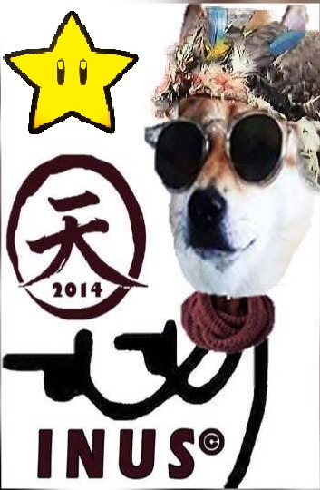

# Inus MemeBot

Discord Bot for the Inus online community  
Implements text responses
Meme Responses(Searchs for a imagen when "#" leads the message sent)

## Dependencies
-[discord.py](https://discordpy.readthedocs.io/en/stable/)

## Host
Currently hosted in [AWS EC2](https://aws.amazon.com/ec2/) freetier 

## Files
- **img:** Folder contains imagen files 
    -- Image file format named as the call 
- **create_dic.py:** Creates a python dictonary with the imagen files 
- **dic.py:** Python dictonary with entrys for meme responses
- **main.py** Contains the Bot configuration and key
- **key.env** (Not included due security reasons) Contains the bot key generated at [Discord Applications](https://discord.com/developers/applications)

## Set Up
Git clone 
Follow steps to create a bot in [Discord Applications](https://discord.com/developers/applications)
Open **create_dic.py** and edit the paths as needed 
Execute bash command in the folder "YourPath/MemeBot/"
`python create_dic.py`
Get the discord app key and create a key.env file with the key inside
`python main.py`

## Usage
The bot will response with a meme coresponding to the comand
`#memename`

